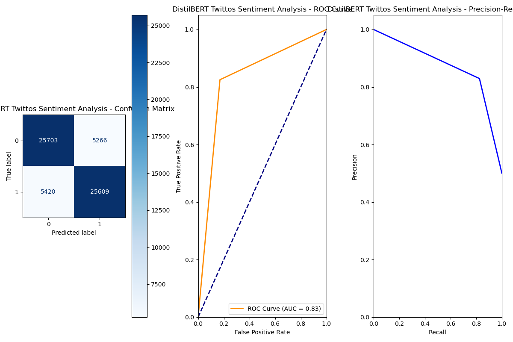

# 🐦 Twitter Sentiment Analysis with DistilBERT

This project implements a **binary sentiment analysis model** using the `distilbert-base-uncased` transformer on a large [**dataset**](https://huggingface.co/datasets/carblacac/twitter-sentiment-analysis) of tweets. The model classifies tweets as either **positive** or **negative**, with visual evaluation through confusion matrices, ROC curves, and precision-recall plots.

---

## 🧠 Model Highlights

- 🔍 **Pretrained Model:** Uses Hugging Face’s `distilbert-base-uncased`
- 🧹 **Preprocessing:** Custom tweet cleaning (lowercasing, URL/user removal, punctuation stripping)
- 🧪 **Evaluation:** Includes confusion matrix, ROC curve, and precision-recall curve
- 💥 **Metrics Tracked:** Accuracy (via `Trainer`)
- 📉 **Regularisation:** Dropout applied to hidden and attention layers
- 📊 **Visualization:** Saves evaluation plots after testing

---

## 📂 Project Structure

|── src.py # Main script: loads, cleans, trains, evaluates

|── dataset/

| |── train_150k.txt # Training dataset (from Kaggle)

| |── test_62k.txt # Test dataset (from Kaggle)

|── plots/ # Output directory for evaluation plots

---

## 📥 Dataset

For convenience, the dataset is already included in this repository.

Original source: [**Twitter Sentiment Analysis Dataset on Hugging Face**](https://huggingface.co/datasets/carblacac/twitter-sentiment-analysis)

Each file contains rows in this format:
```txt
<label>\t<tweet text>
```

---

## 🛠️ How to Run

### 1. Clone the Repo
```bash
git clone https://github.com/your-username/twitter-sentiment-bert.git
cd twitter-sentiment-bert
```

### 2. Install Dependencies
```bash
pip install transformers accelerate torch scikit-learn matplotlib pandas
```

### 3. Run the Training Script
```bash
python src.py
```

---

## ⚙️ Hyperparameters & Settings

```python
num_train_epochs = 5
per_device_train_batch_size = 128
learning_rate = 2e-5
dropout = 0.65
weight_decay = 0.05
model = "distilbert-base-uncased"
```
Device auto-selected: CUDA, MPS (Apple Silicon), or CPU.

---

📸 Evaluation Output
After training, a plot like this will be generated and saved to plots/:
- Confusion Matrix
- ROC Curve
- Precision-Recall Curve

Here’s a sample output plot:



